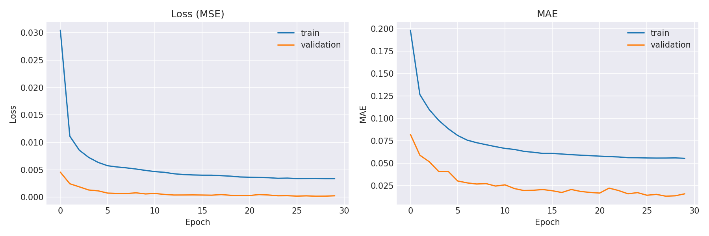
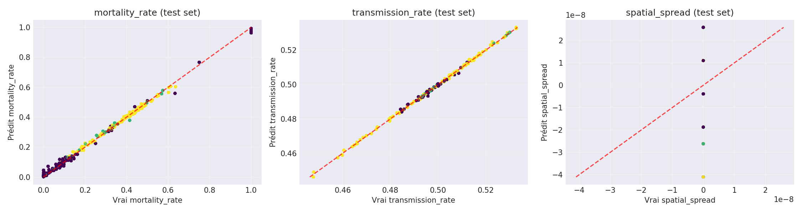

# Projet Machine Learning - Prédiction d'Indicateurs Épidémiologiques

## Initialisation du projet

Pour initialiser le projet sur votre machine voici la liste des commandes que j'ai utilisé pour tester le projet de 0 (j'ai utilisé git bash pour utiliser des commandes linux faites l'équivalent pour votre OS)

(Il faudra bien penser à lancer Docker Desktop avant d'utiliser les commandes)

```bash
docker-compose up -d
```

Une fois le conteneur créé Ctrl shift p pour ouvrir le projet avec toutes les dépendances nécessaires.

## Description du projet

Cette partie du projet s'occupe de la partie machine learning. L'objectif est de prédire trois indicateurs épidémiologiques (le taux de croissance, le taux de mortalité et le taux de propagation géographique.) afin d'entraîner notre modèle nous avons utilisé les données disponibles sur le repository github "OWID" Our World in Data.

Cette partie est structuré en 3 notebooks principaux qui couvrent l'ETL le prétraitement des données nettoyant et la modélisation prédictive.

## Structure des notebooks

Vous trouverez dans le dossier ETL les 2 étapes de l'ETL (initial et nettoyages des données puis gestion des outliers et des agrégation hebdomadaires)

Ensuite un notebook LSTM multi cibles qui permet d'entraîner notre modèle sur différentes métriques.

Il faut savoir que c'est la dernière version du projet d'autres modèles ont été entraînés (XGBOOST, RandomForest et un modèle de régression linéaire) nous avons choisi de partager ce notebook ci car il obtient les meilleures performances (MSE global MAE global RMSE global / MAE et RMSE par cible (mortality_rate, transmission_rate, spatial_spread) ) et il est le modèle qui malgré le fait qu'on entraîne uniquement sur le covid avait le moins d'overfitting

## Gestion des outliers

Pour gérer les Outliers nous avons utiliser 3 niveaux :
- Les extrêmes qui correspondaient à 21% des données on leur a donné un poids de 0.3
- Les données incomplètes qui correspondaient à 5% des données ont eu un poids de 0.5
- Les données de qualité qui correspondaient à 78% des données avec un poids de 1

Les valeurs extrêmes ont été capées au 99.9e percentile

## Métriques et normalisation

Pour les 3 métriques nous avons normalisé le ratio log-transformé entre décès et cas

Pour la transmission nous avons fait des changements relatifs du R0 par rapport à une moyenne mobile

## Feature Engineering

- **Features temporelles** : Encodage cyclique (sin/cos) pour capturer la saisonnalité
- **Épidémique** : Détection dynamique de 6 phases correspondantes à celles du covid :
  - pré-épidémique
  - croissance
  - pic
  - déclin
  - contrôlé
  - résurgence
- **Donnée géographique** : Distance entre pays nombre de voisin dans un rayon de 1000km
- **Indicateurs de qualité** : Données manquantes et poids de régression

## Architecture du LSTM

L'architecture du LSTM était de ce type :

```python
Sequential([
    LSTM(64, dropout=0.2, recurrent_dropout=0.1),
    Dense(32, activation='relu'),
    Dropout(0.2),
    Dense(3, activation='linear')
])
```

## Résultats obtenus

Voici nos métriques :

| Métrique | Train | Validation | Test |
|----------|-------|------------|------|
| MAE Global | 0.0534 | 0.0137 | 0.0135 |
| RMSE Global | 0.0710 | 0.0197 | 0.0193 |

**MAE par cible sur l'ensemble de test :**
- Mortality Rate: 0.0146
- Transmission Rate: 0.0093
- Spatial Spread: 0.0165

Nous avons eu uniquement 1.5% de dégradation entre nos validation et notre test.

Le modèle s'est avéré excellent pour 2 métriques (le taux de transmission et de mortalité) mais nous n'avons pas réussi à obtenir des résultats concluants pour la propagation géographique il aurait sûrement fallu d'après nous d'autres métriques.

## Analyse des résultats

### Courbes d'entraînement


Les courbes d'entraînement montrent :
- **Convergence rapide** : Le modèle converge efficacement dès les premières époques
- **Pas de surapprentissage** : Les courbes de validation suivent bien celles d'entraînement
- **Stabilité** : Après 10 époques, les métriques se stabilisent

### Prédictions sur l'ensemble de test


Jaune : Poids = 1.0 Données de haute qualité
Vert : Poids = 0.5 Données incomplètes (moins de 3 jours dans la semaine)
Violet : Poids = 0.3 Outliers extrêmes (z-score > 5)

L'analyse des scatter plots révèle :
- **Mortality Rate** : Excellente corrélation (points alignés sur la diagonale), prédictions très fiables
- **Transmission Rate** : Très bonne performance, légère dispersion mais prédictions cohérentes
- **Spatial Spread** : Performance limité